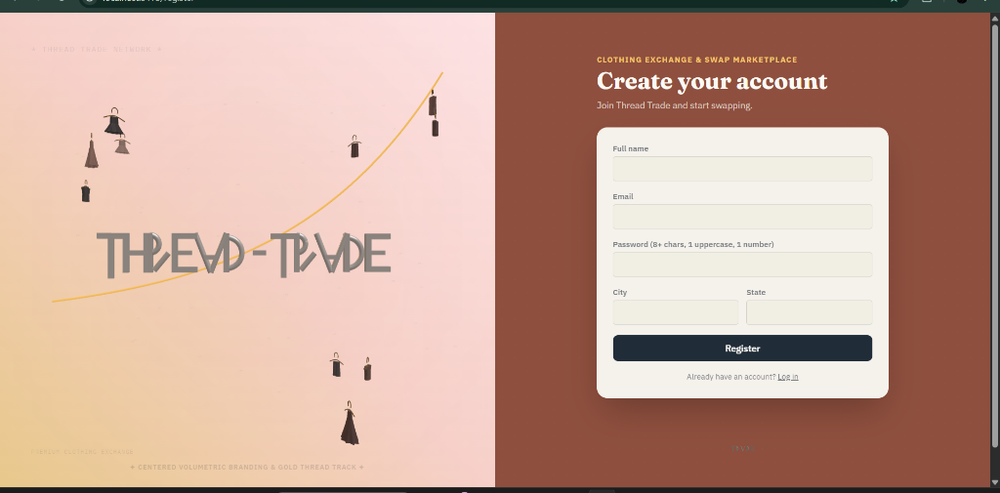
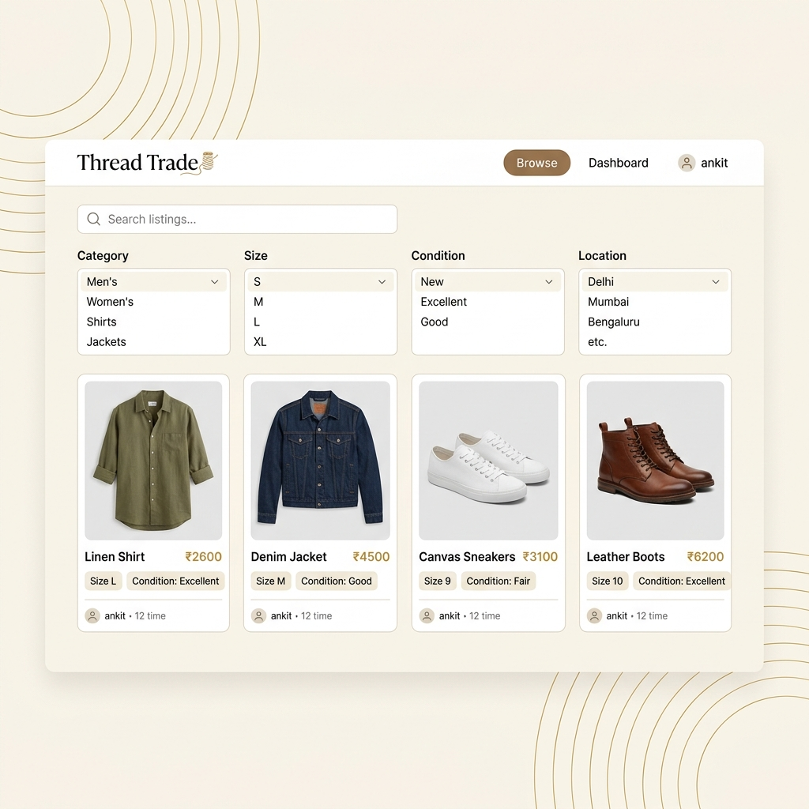
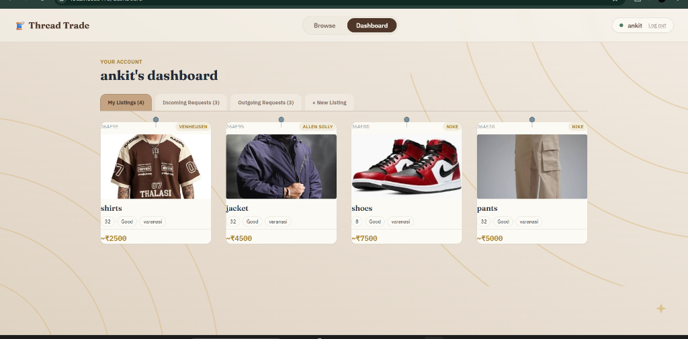
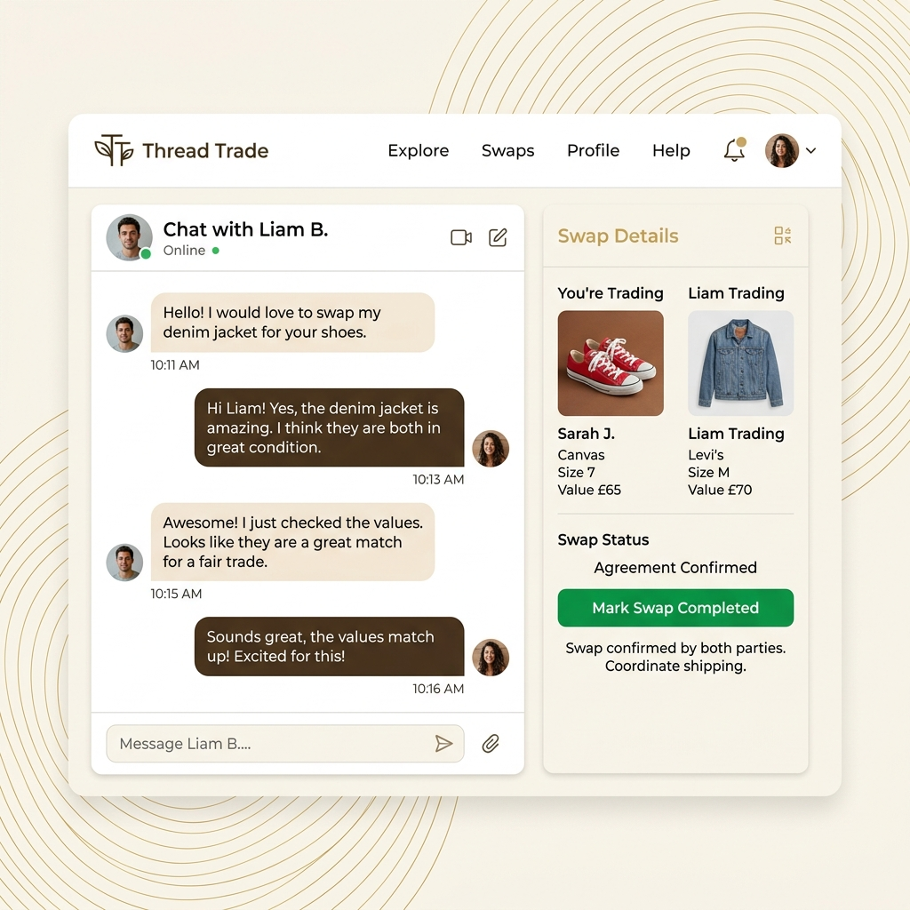
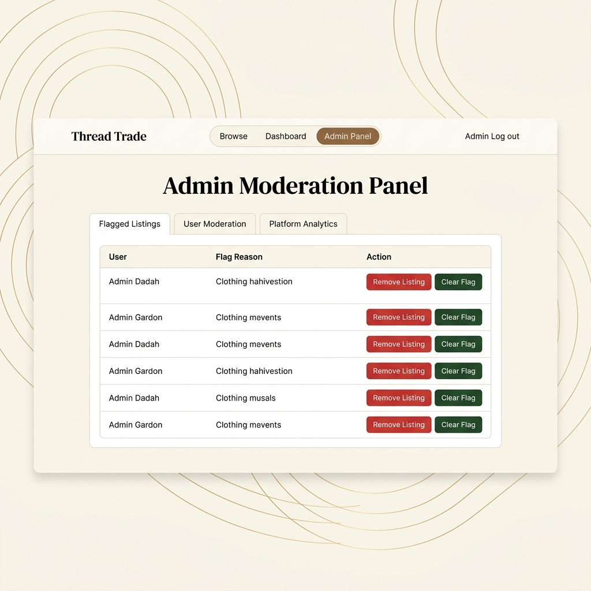
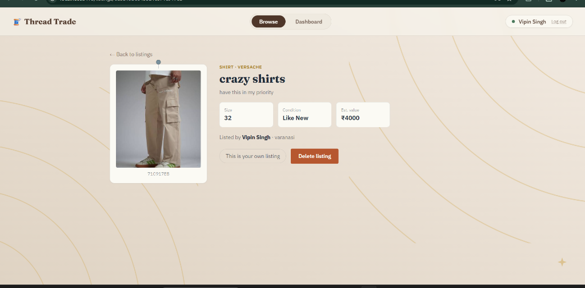
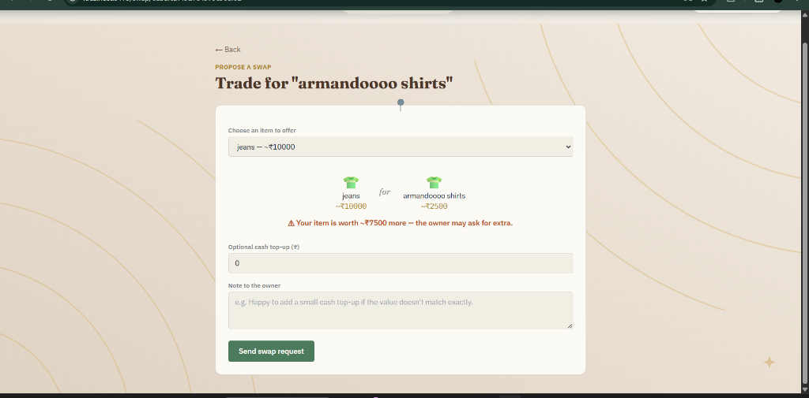

<div align="center">


# 🧵 Thread Trade
### Clothing Exchange & Swap Marketplace

**Swap clothes — not cash. Give your wardrobe a second life.**

[](https://thread-trade.vercel.app)
[](https://thread-trade-40qe.onrender.com/api/health)
[](LICENSE)
[](CONTRIBUTING.md)



</div>

---

## ✨ What is Thread Trade?

Thread Trade is a **barter-first clothing marketplace** — users swap clothes directly with each other instead of buying or selling. Think of it as a sustainable, community-driven alternative to fast fashion.

- **No money needed** — propose a swap, negotiate in real-time chat, and exchange
- **Fair-value calculator** — ensures both sides are trading items of similar worth
- **Location-aware** — find swaps near you with geospatial search
- **Real-time everything** — live chat, typing indicators, instant notifications via Socket.IO

---

## 🖼️ Screenshots

<table>
  <tr>
    <td align="center"><br/><sub>Browse Listings</sub></td>
    <td align="center"><br/><sub>User Dashboard</sub></td>
  </tr>
  <tr>
    <td align="center"><br/><sub>Live Chat & Negotiation</sub></td>
    <td align="center"><br/><sub>Admin Panel</sub></td>
  </tr>
  <tr>
    <td align="center"><br/><sub>Item Detail</sub></td>
    <td align="center"><br/><sub>Propose a Swap</sub></td>
  </tr>
</table>

---

## 🚀 Tech Stack

<table>
  <tr>
    <th>Layer</th>
    <th>Technology</th>
    <th>Purpose</th>
  </tr>
  <tr>
    <td><b>Frontend</b></td>
    <td>React 18 + Vite + Tailwind CSS</td>
    <td>SPA with beautiful responsive UI</td>
  </tr>
  <tr>
    <td><b>Backend</b></td>
    <td>Node.js + Express</td>
    <td>REST API + Socket.IO server</td>
  </tr>
  <tr>
    <td><b>Database</b></td>
    <td>MongoDB Atlas + Mongoose</td>
    <td>Data storage with geospatial indexing</td>
  </tr>
  <tr>
    <td><b>Auth</b></td>
    <td>JWT (access + refresh tokens)</td>
    <td>Secure, stateless auth with auto-refresh</td>
  </tr>
  <tr>
    <td><b>Real-time</b></td>
    <td>Socket.IO</td>
    <td>Live chat, typing indicators, notifications</td>
  </tr>
  <tr>
    <td><b>Images</b></td>
    <td>Cloudinary</td>
    <td>CDN image upload & optimization</td>
  </tr>
  <tr>
    <td><b>Validation</b></td>
    <td>Zod</td>
    <td>Type-safe request schema validation</td>
  </tr>
  <tr>
    <td><b>Deployment</b></td>
    <td>Vercel (frontend) + Render (backend)</td>
    <td>CI/CD on every push</td>
  </tr>
</table>

---

## 🏗️ Architecture

```
thread-trade/
├── backend/                   Node.js + Express API
│   ├── server.js              Entry point — HTTP + Socket.IO
│   └── src/
│       ├── app.js             Middleware + route mounting
│       ├── config/            DB, logger, Cloudinary
│       ├── models/            User, Listing, SwapRequest, Message,
│       │                      Review, Report, Notification, AuditLog
│       ├── middleware/        auth.js (JWT), validate.js (Zod), errorHandler.js
│       ├── controllers/       Business logic per module
│       ├── routes/            Express routers per module
│       ├── sockets/           Socket.IO chat gateway
│       └── utils/             Tokens, email, validators, audit, seed
│
├── frontend/                  React 18 + Vite + Tailwind
│   └── src/
│       ├── api/               Axios instance (auto token refresh) + services
│       ├── context/           AuthContext (session state)
│       ├── hooks/             useSocket (Socket.IO client)
│       ├── routes/            ProtectedRoute / AdminRoute guards
│       ├── components/        Navbar (with mobile hamburger), ListingCard
│       └── pages/             Login, Register, Listings, ItemDetail,
│                              SwapRequestPage, Dashboard, Chat, Admin
│
├── docker-compose.yml         One-command local dev (backend + frontend + MongoDB)
└── README.md
```

---

## ⚡ Quick Start

### Prerequisites
- **Node.js 20+** and npm
- **MongoDB** — free [Atlas](https://cloud.mongodb.com) cluster recommended
- *(Optional)* **Cloudinary** account for photo uploads

### 1. Clone

```bash
git clone https://github.com/anmol-23-singh/thread-trade.git
cd thread-trade
```

### 2. Backend

```bash
cd backend
npm install
cp .env.example .env     # fill in MONGO_URI, JWT secrets
npm run seed             # loads demo users + listings
npm run dev              # starts on http://localhost:5000
```

Verify: `http://localhost:5000/api/health` should return `{"success":true,"status":"ok"}`

### 3. Frontend

```bash
# in a new terminal
cd frontend
npm install
cp .env.example .env     # VITE_API_URL=http://localhost:5000/api
npm run dev              # starts on http://localhost:5173
```

### 4. Or use Docker (all-in-one)

```bash
# from the repo root
docker compose up --build
```

Frontend → `http://localhost:5173` | Backend → `http://localhost:5000`

### 5. Demo accounts (after seeding)

| Email | Password | Role |
|-------|----------|------|
| `ananya@example.com` | `Swap_123` | User |
| `devika@example.com` | `Swap_123` | User |
| `rohit@example.com` | `Swap_123` | User |
| `admin@example.com` | `Swap_123` | **Admin** |

---

## 🔐 Auth Design

| Token | Lifetime | Storage | Notes |
|-------|----------|---------|-------|
| Access Token | 15 min | React memory only | Sent as `Authorization: Bearer` |
| Refresh Token | 30 days | `httpOnly` cookie | Rotated on every use, invisible to JS |

The frontend Axios interceptor silently calls `/api/auth/refresh` on any 401 and retries — keeping users logged in transparently.

---

## 🗺️ Feature Map (PRD → Code)

| Feature | Backend | Frontend |
|---------|---------|----------|
| Auth (register / login / refresh) | `authController.js` | `Login.jsx`, `Register.jsx` |
| Listing CRUD + Cloudinary upload | `listingController.js` | `Listings.jsx`, `Dashboard.jsx` |
| Swap request lifecycle | `swapController.js` | `SwapRequestPage.jsx`, `Dashboard.jsx` |
| Real-time chat + typing | `sockets/chatSocket.js` | `Chat.jsx` |
| Fair-value calculator | `swapController.isFairMatch` | `SwapRequestPage.jsx` (live preview) |
| Geospatial nearby search | `Listing` 2dsphere index | `Listings.jsx` filters |
| Wishlist | `userController.toggleWishlist` | `ItemDetail.jsx` |
| Reviews & ratings | `reviewController.js` | `Chat.jsx` (post-swap) |
| Notifications | `Notification` model + Socket emit | API ready, bell UI pending |
| Admin dashboard | `adminController.js` | `Admin.jsx` |
| Audit logs | `utils/audit.js` | API ready, UI pending |

---

## 🌐 Deployment

| Service | Platform | URL |
|---------|----------|-----|
| Frontend | Vercel | https://thread-trade.vercel.app |
| Backend API | Render | https://thread-trade-40qe.onrender.com |

Environment variables are documented in [`backend/.env.example`](backend/.env.example).

---

## 🤝 Contributing

Contributions are welcome! Please read [CONTRIBUTING.md](CONTRIBUTING.md) first.

---

## 📄 License

Distributed under the **MIT License**. See [LICENSE](LICENSE) for details.

---

<div align="center">
  Made with ❤️ by <a href="https://github.com/anmol-23-singh">Anmol Singh</a>
  <br/>
  <sub>Built as part of the Unified Mentor Internship Program</sub>
</div>
